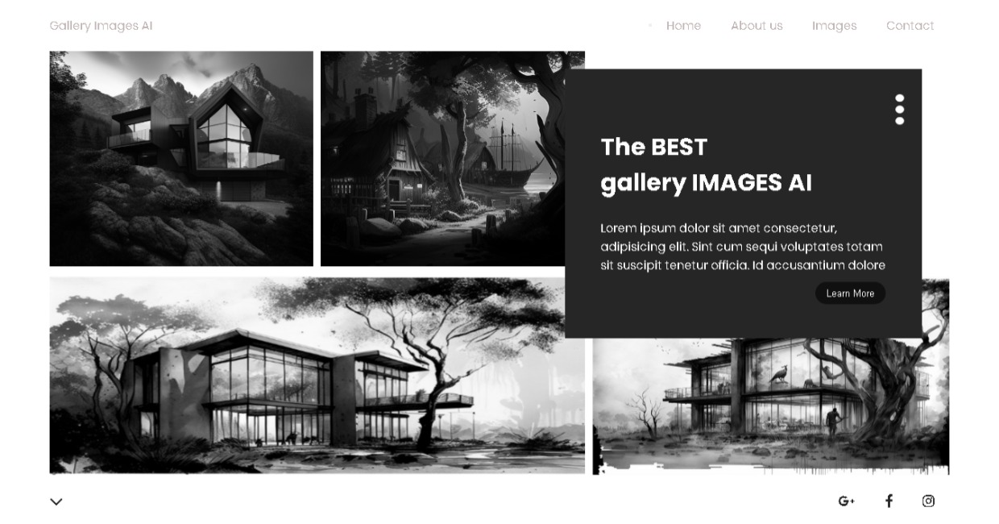

<h1 align="center">
 🖼️ Gallery Images
</h1>

## 📝 Descrição 

Uma galeria de imagens onde todas elas foram geradas por uma IA. A galeria foi toda desenvolvida com CSS grid, e flex-box.

- Versão Final: [Gallery Images](https://marcelo-abreeu.github.io/Gallery-Images/)

## 🚀 Tecnologias

Esse projeto foi desenvolvido com as seguintes tecnologias:

- HTML
- CSS
- JavaScript

## 📚 Bibliotecas

- [Google Fonts](https://fonts.google.com/)
- [Fonts Awesome](https://fontawesome.com/)

-----

  <h3 align="center"> Developed by <a href="#">Marcelo Abreu</a> ☕</h3>

 
